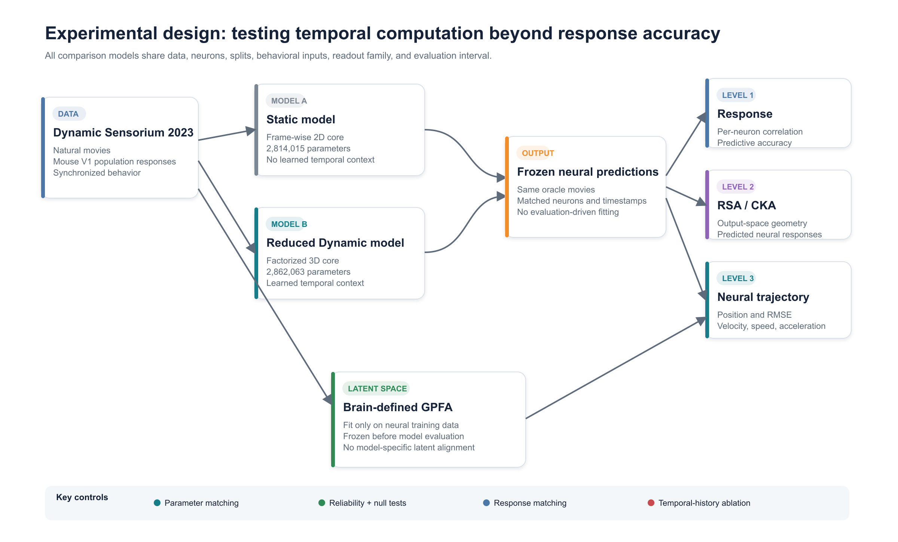
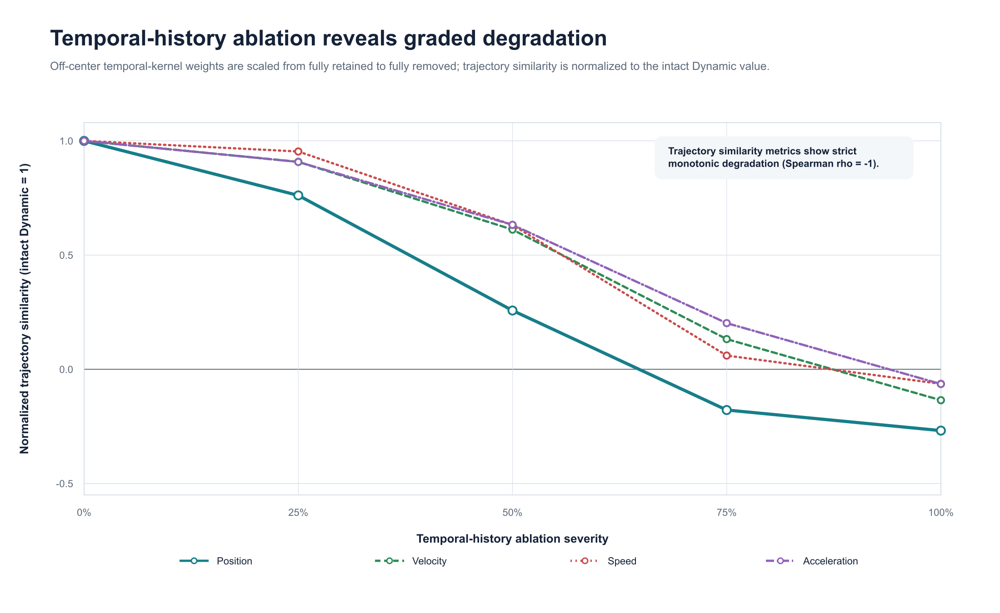

# Evaluating Dynamic Neural Encoding Beyond Response Correlation

**Can trajectory-based neural evaluation reveal dynamic encoding gains that response correlation and output-space population-response metrics do not fully capture?**

## At a glance

**Question:** Does trajectory evaluation capture Dynamic-model gains missed by response correlation and output-space RSA/CKA?  
**Approach:** Dynamic Sensorium 2023, a capacity-controlled Static-Dynamic comparison, and a frozen brain-defined GPFA.  
**Current result:** Response and time-aware output-space RSA/CKA detect part of the gain, while response-matched and temporal-ablation tests suggest that trajectory metrics provide additional sensitivity to temporal structure.

Neural encoding models are usually judged by how accurately they predict each neuron's response. That criterion is essential, but it may under-characterize what makes a model *dynamic*: its ability to reproduce how a neural population state evolves over time. This project builds a controlled Static-Dynamic comparison on Dynamic Sensorium 2023 and tests response accuracy, output-space population-response geometry (RSA/CKA), and neural-trajectory agreement on the same predicted neural responses.

The central hypothesis is that, if temporal computation contributes more than a frame-wise response gain, a Dynamic model should remain distinguishable from a Static model after controlling model capacity and response quality, and trajectory scores should degrade systematically when learned temporal history is ablated.



## Experimental design

The main controlled comparison uses models trained on the same five sessions, inputs, behavioral covariates, neurons, splits, loss, readout family, and evaluation interval. The Static model has **2,814,015 parameters**. The reduced Dynamic model has **2,862,063 parameters**, a difference of only **1.71%**, while retaining learned temporal convolutions. The full official Dynamic baseline is also preserved as a benchmark.

For the detailed trajectory study, a deterministic 512-neuron subset from one session is used. GPFA is trained on 174 trials (50% of that session's official training tier) and is frozen before any model prediction or oracle response is transformed. Evaluation uses six repeated natural movies, 58 oracle trials, and 250 timestamps per trial.

## Baseline reproduction

| Model | Official reference | Local reproduction | Status |
|---|---:|---:|---|
| Factorized3D Dynamic | 0.1887 hidden `final_test_main` | 0.1967 local oracle | Protocol reproduced; exact hidden-test score is not locally verifiable. |
| Static-on-Dynamic | No official reference for this transfer setting | 0.1644 local oracle | The official Static Sensorium architecture was retrained on Dynamic Sensorium 2023; this is not the native Sensorium 2022 static-image benchmark. |

Both local values are full-sequence, five-session single-trial correlations computed with the official Sensorium evaluator. Hidden test labels are unavailable locally, so exact server-side reproduction of the Dynamic score remains pending. See the [Dynamic](docs/models/DYNAMIC_MODEL.md) and [Static](docs/models/STATIC_MODEL.md) reports for the full protocol and audit trail.

## Why the latent space is brain-defined

GPFA is fitted only to real neural responses from the training tier. Its preprocessing, observation model, temporal prior, and latent axes are then frozen. Static and Dynamic predictions are treated as new observations and passed through the same frozen GPFA posterior inference with fixed `C`, `d`, `R`, and temporal priors; no model-specific GPFA or post-hoc latent alignment is used.

This design prevents either encoding model from defining a favorable comparison space. It also preserves temporal direction: position, velocity, speed, and acceleration can all be compared in coordinates learned independently from the model predictions.

## Preliminary findings


| Question | Current answer | Main evidence |
|---|---|---|
| **Q1. Response gain?** | **Yes.** | Parameter-matched Dynamic improves five-session oracle correlation by **0.0231**; all session differences are positive. |
| **Q2. Output-space RSA/CKA difference?** | **Yes.** | Time-aware population-response RSA and CKA consistently favor Dynamic; purely condition-averaged differences are smaller. |
| **Q3. Trajectory difference?** | **Yes.** | Dynamic substantially improves GPFA position and direction-sensitive trajectory metrics; speed-profile evidence is weaker. |
| **Q4. Difference after response matching?** | **Yes, in the current stress test.** | Held-out response scores are nearly identical after predefined response matching, while GPFA position, velocity, and acceleration still favor Dynamic. |
| **Q5. Monotonic temporal-ablation degradation?** | **Yes for trajectory similarity.** | Position, velocity, speed, and acceleration decrease strictly across five history-retention levels; normalized RMSE has one small non-monotonic step. |
| **Q6. Fully explained by response/output-space RSA/CKA?** | **Current evidence suggests not fully.** | Time reversal and out-of-family perturbation tests leave residual temporal-order and local-direction information. |

Detailed estimates, uncertainty intervals, and metric-specific qualifications are reported in [Model Comparison Results](docs/results/MODEL_COMPARISON_RESULTS.md) and [Q1-Q6 Answers](docs/results/Q1_Q6_ANSWERS.md).



The trajectory method was validated before it was used to rank models. In 200 split-half comparisons of repeated neural responses, position correlation averaged **0.8566**, velocity-direction cosine **0.6627**, speed-profile correlation **0.7434**, and acceleration-direction cosine **0.6163**. These metrics rejected matched condition, time-order, timing, and population-synchrony nulls in every split tested. Path length is retained only as a descriptive control because it cannot reliably detect time reversal or circular shifts.

These results support a specific claim: trajectory evaluation captures temporal-order and local-direction information that scalar response correlation and the tested output-space RSA/CKA variants do not fully summarize. They do **not** show that these metrics are uninformative; time-aware population-response RSA and CKA detect clear Dynamic-Static differences. Nor do they show that trajectory metrics are independent of every possible output-space similarity metric.

Here, RSA and CKA compare predicted neural population responses with recorded neural population responses. They do **not** compare hidden network layers. Hidden-layer RSA/CKA is outside the primary comparison so response, output geometry, and trajectory metrics all evaluate the same model outputs.

## Why this matters

If this pattern generalizes across additional sessions, evaluating dynamic encoding models only through point-wise neural prediction may miss whether they reproduce the temporal organization of population activity. Trajectory evaluation would therefore complement, rather than replace, response correlation and output-space population-response similarity.

## Models and data

The dataset is Dynamic Sensorium 2023: natural movies, synchronized behavioral variables, and mouse V1 population responses with continuous temporal structure. Dataset files are not redistributed here; place an authorized local copy at `data/sensorium_all_2023/`.

| Model artifact | Role | Parameters |
|---|---|---:|
| [`models/official_dynamic/best.pt`](models/official_dynamic/best.pt) | Full official Factorized3D Dynamic benchmark | 5,707,743 |
| [`models/static_on_dynamic/best.pt`](models/static_on_dynamic/best.pt) | Static Sensorium CNN retrained frame-wise on Dynamic Sensorium | 2,814,015 |
| [`models/parameter_matched_dynamic/best.pt`](models/parameter_matched_dynamic/best.pt) | Reduced Dynamic model used in the controlled comparison | 2,862,063 |
| [`models/parameter_matched_dynamic/epoch_65_response_matched.pth`](models/parameter_matched_dynamic/epoch_65_response_matched.pth) | Training-history response-matched checkpoint | 2,862,063 |
| [`models/gpfa_reliability/`](models/gpfa_reliability/) | Frozen GPFA and preprocessing from the reliability study | n/a |
| [`models/gpfa_model_comparison/`](models/gpfa_model_comparison/) | Frozen subset-trained GPFA used for model comparison | n/a |

Neural-network checkpoints contain public `state_dict` tensors rather than machine-specific trainer state. File sizes and SHA-256 hashes are listed in [`results/manifests/model_files.csv`](results/manifests/model_files.csv). Binary model artifacts are configured for Git LFS.

## Repository guide

```text
.
|-- docs/
|   |-- models/       # Static, full Dynamic, and parameter-matched Dynamic protocols
|   |-- methods/      # Brain-defined GPFA design and result-blind locked protocol
|   \-- results/      # Reliability, model comparison, and Q1-Q6 reports
|-- experiments/
|   |-- 01_baselines/           # Static and full Dynamic training/evaluation
|   |-- 02_gpfa_reliability/    # GPFA selection, reliability, nulls, sensitivity
|   |-- 03_parameter_matching/  # Reduced Dynamic audit, training, evaluation
|   \-- 04_model_comparison/    # Response, RSA, CKA, GPFA, controls, Q1-Q6
|-- models/          # Released trained weights and frozen GPFA objects
\-- results/         # Compact result tables and artifact manifests
```

Phase-level introductions:

1. [Phase 1: trustworthy Static and Dynamic baselines](experiments/01_baselines/README.md)
2. [Phase 2: brain-defined GPFA reliability](experiments/02_gpfa_reliability/README.md)
3. [Phase 3: Dynamic-Static parameter matching](experiments/03_parameter_matching/README.md)
4. [Phase 4: model comparison beyond response correlation](experiments/04_model_comparison/README.md)

Recommended reading order:

1. Research logic: [design rationale](docs/DESIGN_RATIONALE.md).
2. Current coverage: [experiment matrix](docs/EXPERIMENT_MATRIX.md).
3. Complete implementation: [methods](docs/METHODS.md).
4. Model protocols: [Static](docs/models/STATIC_MODEL.md), [full Dynamic](docs/models/DYNAMIC_MODEL.md), and [parameter-matched Dynamic](docs/models/PARAMETER_MATCHED_DYNAMIC.md).
5. Method validation: [brain-defined GPFA](docs/methods/BRAIN_DEFINED_GPFA.md), [locked protocol](docs/methods/GPFA_PROTOCOL_LOCKED.md), and [reliability results](docs/results/GPFA_RELIABILITY_RESULTS.md).
6. Main evidence: [model-comparison results](docs/results/MODEL_COMPARISON_RESULTS.md) and [direct Q1-Q6 answers](docs/results/Q1_Q6_ANSWERS.md).

## Reproducing the analysis

The repository preserves source code, phase-specific configurations, training records, compact output tables, trained model weights, and frozen GPFA objects. Large raw data and full prediction tensors are intentionally excluded.

1. Install Git LFS before cloning or pulling model files.
2. Obtain Dynamic Sensorium 2023 through its official distribution and place it under `data/sensorium_all_2023/`.
3. Use Python 3.11 for the complete pipeline. Each experiment is an installable package with its own `pyproject.toml` and locked configuration.
4. Run the phases in numerical order. The README inside each phase lists its commands and prerequisites; later phases fail closed if an expected checkpoint, prediction tensor, data split, or frozen GPFA artifact is missing.

The public tree has passed **19 contract and analysis tests** across the four experiment packages. Existing compact results can be inspected without downloading the dataset, beginning with [`results/tables/04_model_comparison/q1_q6_answers.json`](results/tables/04_model_comparison/q1_q6_answers.json).

The complete setup instructions, official download links, session IDs, expected data tree, hardware requirements, minimal audit commands, and checkpoint-loading example are provided in the [Data and Reproducibility Guide](docs/DATA_AND_REPRODUCIBILITY.md).

## License, citation, and contact

Original project code and documentation are released under the [MIT License](LICENSE). Raw Sensorium data are not included and remain subject to the official provider's terms. Sensorium and `neuralpredictors` attribution, pinned upstream revisions, and license boundaries are documented in [Third-Party Notices](THIRD_PARTY_NOTICES.md).

Use [`CITATION.cff`](CITATION.cff) to cite the repository, and cite the Dynamic Sensorium dataset papers separately. The primary author is [Xiaotian Zhu](AUTHORS.md), and reproducibility questions can be submitted through [GitHub Issues](https://github.com/124585083/neural-trajectory-evaluation/issues).

## Scope

This is a proof-of-concept evaluation study, not a claim that GPFA trajectories are the definitive representation of cortical computation or that the selected Dynamic architecture is a cortical mechanism. Q1 uses five sessions, but the deeper output-space RSA/CKA, GPFA, response-matching, and ablation analyses currently use one session, 512 neurons, and six repeated movie conditions. Multi-session trajectory evaluation and multi-seed encoding-model replication remain necessary before making a broad biological claim.

The intended contribution is narrower: to test whether neural-trajectory evaluation provides useful information *in addition to* response accuracy and output-space population-response geometry when assessing temporally structured encoding models.

## References

1. Wang et al. (2024). [Retrospective for the Dynamic Sensorium Competition for predicting large-scale mouse primary visual cortex activity from videos](https://proceedings.neurips.cc/paper_files/paper/2024/hash/d758d7c0a88d741c8ca4637579c9df87-Abstract-Datasets_and_Benchmarks_Track.html). *NeurIPS 2024 Datasets and Benchmarks Track*.
2. Willeke et al. (2023). [Retrospective on the SENSORIUM 2022 competition](https://proceedings.mlr.press/v220/willeke23a.html). *Proceedings of Machine Learning Research, 220*.
3. Yu et al. (2009). [Gaussian-process factor analysis for low-dimensional single-trial analysis of neural population activity](https://doi.org/10.1152/jn.90941.2008). *Journal of Neurophysiology, 102*(1), 614-635.
4. Kriegeskorte, Mur, and Bandettini (2008). [Representational similarity analysis - connecting the branches of systems neuroscience](https://doi.org/10.3389/neuro.06.004.2008). *Frontiers in Systems Neuroscience, 2*.
5. Kornblith et al. (2019). [Similarity of Neural Network Representations Revisited](https://proceedings.mlr.press/v97/kornblith19a.html). *Proceedings of Machine Learning Research, 97*, 3519-3529.
