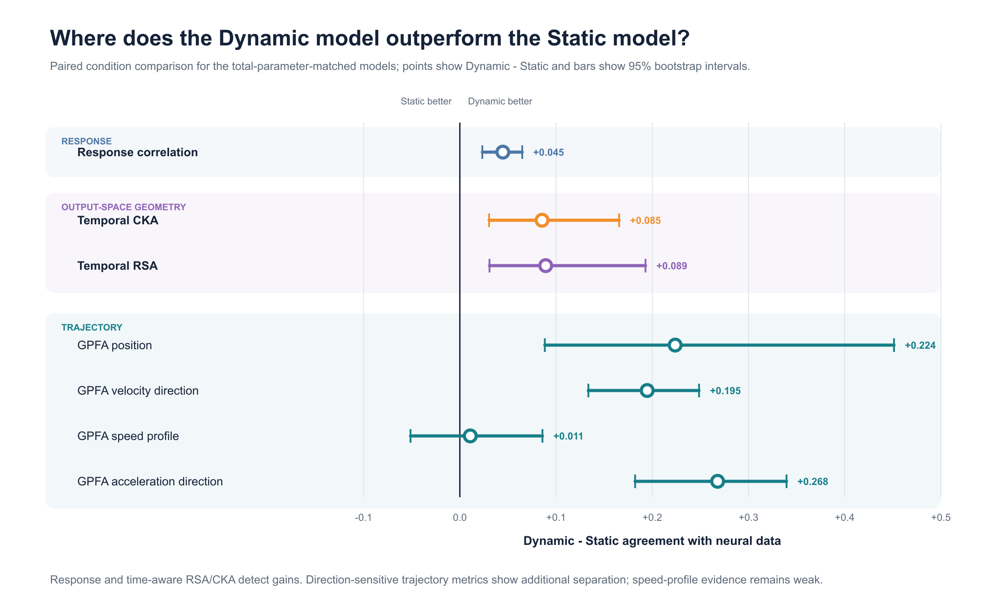

# Evaluating Dynamic Neural Encoding Beyond Response Correlation

Can trajectory-based evaluation of neural population dynamics reveal meaningful differences between Static and Dynamic encoding models that are incompletely summarized by response correlation and population-response representation similarity?

This repository is a proof-of-concept study of evaluation methodology for dynamic neural encoding models using Dynamic Sensorium 2023.

## Why trajectory evaluation?

Neural encoding models can be evaluated at three complementary levels:

- **Response correlation** asks whether individual neural responses are predicted accurately.
- **Output-space RSA / CKA** asks whether predicted and recorded population responses share similar representational structure.
- **Trajectory evaluation** asks whether predicted population states evolve through time with the correct position, direction, speed, and local geometry.

RSA and CKA here compare predicted neural population responses with recorded responses; they are not hidden-layer analyses. Trajectory evaluation is intended to complement, not replace, response prediction and population-response similarity.

## Experimental logic

> Static and Dynamic encoding models → response correlation → output-space RSA / CKA → neural-data-defined GPFA trajectories → controlled stress tests

The trajectory coordinate system is fitted exclusively to recorded training neural responses. GPFA reliability is validated first; its preprocessing, latent axes, and temporal model are then frozen before Static or Dynamic predictions enter the analysis. Both models are therefore evaluated in the same neural-data-defined space rather than in separately fitted, model-specific latent spaces.

The primary control compares a four-layer frame-wise 2D Static architecture with a three-stage Factorized3D Dynamic architecture that explicitly incorporates temporal convolutions. Their total trainable parameter counts are approximately matched—2,814,015 for Static and 2,862,063 for Dynamic, a difference of 48,048 parameters or 1.707%—but their cores remain different architectures and are not parameter matched.

## Main findings

### 1. Dynamic models predict neural responses better

Across five Dynamic Sensorium sessions, mean oracle response correlation increases from approximately **0.1644** for Static to **0.1875** for the Total-parameter-matched Dynamic model, a difference of approximately **+0.0231**. Dynamic is higher in all five sessions.

This is a complete-model comparison under approximately matched total trainable parameter counts. It does not isolate temporal history as the sole cause of the Dynamic advantage.

### 2. The Dynamic advantage is especially visible in temporally structured population geometry

In the detailed pilot session, time-aware output-space RSA and CKA detect Static–Dynamic differences. Evaluation with the frozen neural-data-defined GPFA further shows stronger Dynamic agreement with recorded neural trajectories in trajectory position, local velocity direction, and acceleration/curvature-related direction.

The speed-profile difference is inconclusive, so the current evidence does not support a uniform Dynamic advantage across every trajectory metric.



> **Figure 2.** Static–Dynamic differences in the one-session, six-condition pilot analysis. Values and uncertainty intervals should be interpreted within each metric family; absolute effect magnitudes are not directly comparable across response correlation, CKA, RSA, and GPFA trajectory metrics.

### 3. Trajectory metrics provide additional sensitivity to temporal structure

Three stress tests probe whether the trajectory results merely restate the conventional scores:

- **Response matching:** after a response-score-matched output perturbation makes held-out scalar response correlations nearly identical, differences in GPFA position, velocity, and acceleration remain detectable. This is an output-level stress test, not a separately trained response-matched model, and no formal equivalence test was performed.
- **Time reversal:** reversing temporal order can leave standard condition-level RSA and CKA unchanged while strongly disrupting GPFA trajectory metrics. This shows that those condition-level metrics are insufficient to capture temporal order and direction; it does not establish mathematical or universal statistical independence from representational metrics.
- **Graded temporal-weight attenuation:** progressively attenuating learned off-center temporal weights produces graded degradation in the major trajectory-similarity metrics. This is **consistent with a graded temporal-history effect, but temporal specificity remains to be controlled**; it is not a clean causal isolation of temporal computation.

Together, these observations suggest that trajectory evaluation captures temporal-order and local-direction information that is not fully summarized by the tested response, RSA, and CKA measures.

## What the current proof of concept covers

- The response-level comparison covers five Dynamic Sensorium sessions.
- Detailed output-space RSA/CKA and trajectory analyses use one pilot session.
- The pilot trajectory analysis uses 512 neurons and 58 oracle trials grouped into six repeated natural-movie conditions over original frames 50–299.
- Encoding-model training uses a single seed.
- The parameter control approximately matches total trainable parameter count, not core architecture or core parameter count. Static and Dynamic therefore form a complete-model architectural comparison rather than an isolation of temporal history alone.
- Temporal-weight attenuation demonstrates graded metric sensitivity to perturbing learned temporal weights, but it does not uniquely isolate a temporal causal effect.

Within this scope, the results support trajectory evaluation as an additional diagnostic for dynamic neural encoding models—not as a definitive representation of cortical computation or a replacement for conventional prediction metrics.

## Documentation

- [Methods](docs/METHODS.md): data preparation, alignment, metrics, GPFA inference, reliability procedures, response matching, and temporal-weight attenuation.
- [Design rationale](docs/DESIGN_RATIONALE.md): why the controls and neural-data-defined comparison space were chosen, including falsification logic.
- [Results](docs/RESULTS.md): the canonical main scientific result chain.
- [Detailed Q1–Q6 evidence](docs/results/Q1_Q6_ANSWERS.md): the canonical question-by-question evidence ledger.
- [GPFA Validation](docs/GPFA_VALIDATION.md): reliability, sensitivity, negative findings, and interpretation limits for the trajectory measurement.
- [Data and reproducibility guide](docs/DATA_AND_REPRODUCIBILITY.md): official data sources, installation, environments, tests, and checkpoint loading.

## Repository orientation and reproduction

```text
docs/          scientific documentation and detailed reports
experiments/   phase-specific code, configurations, commands, and outputs
models/        released encoding-model weights and frozen GPFA objects
results/       figures, compact result tables, and artifact manifests
```

Raw Sensorium data are not redistributed. Obtain the official Dynamic Sensorium 2023 data, install Git LFS for the released model artifacts, and follow the [Data and Reproducibility Guide](docs/DATA_AND_REPRODUCIBILITY.md). Each experimental phase also provides its own operational README.

## License, citation, and contact

Original project code and documentation are released under the [MIT License](LICENSE). Raw Sensorium data remain subject to the official provider's terms; upstream attribution and license boundaries are recorded in [Third-Party Notices](THIRD_PARTY_NOTICES.md).

Use [`CITATION.cff`](CITATION.cff) to cite this repository and cite the Dynamic Sensorium dataset separately. The primary author is [Xiaotian Zhu](AUTHORS.md); reproducibility questions may be submitted through [GitHub Issues](https://github.com/124585083/neural-trajectory-evaluation/issues).

## References

1. Wang et al. (2024). [Retrospective for the Dynamic Sensorium Competition for predicting large-scale mouse primary visual cortex activity from videos](https://proceedings.neurips.cc/paper_files/paper/2024/hash/d758d7c0a88d741c8ca4637579c9df87-Abstract-Datasets_and_Benchmarks_Track.html). *NeurIPS 2024 Datasets and Benchmarks Track*.
2. Willeke et al. (2023). [Retrospective on the SENSORIUM 2022 competition](https://proceedings.mlr.press/v220/willeke23a.html). *Proceedings of Machine Learning Research, 220*.
3. Yu et al. (2009). [Gaussian-process factor analysis for low-dimensional single-trial analysis of neural population activity](https://doi.org/10.1152/jn.90941.2008). *Journal of Neurophysiology, 102*(1), 614–635.
4. Kriegeskorte, Mur, and Bandettini (2008). [Representational similarity analysis—connecting the branches of systems neuroscience](https://doi.org/10.3389/neuro.06.004.2008). *Frontiers in Systems Neuroscience, 2*.
5. Kornblith et al. (2019). [Similarity of Neural Network Representations Revisited](https://proceedings.mlr.press/v97/kornblith19a.html). *Proceedings of Machine Learning Research, 97*, 3519–3529.
