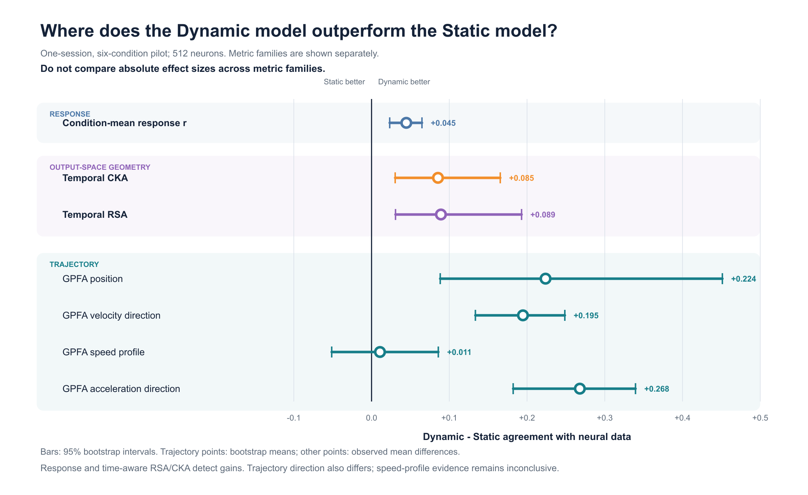

# Evaluating Dynamic Neural Encoding Beyond Response Correlation

How well does a model reproduce the way neural population activity changes over time? Response correlation measures prediction accuracy, but one score can leave the order and direction of population changes unclear. A **neural trajectory** is a sequence of population states over time. Two sequences can have similar average responses while visiting those states in a different order.

This independent secondary analysis uses public data from two tasks. Dynamic Sensorium tests measurements of neural trajectories and compares encoding models. Mental-Pong uses neural representations to reconstruct positions during a ball-interception task. Their data, GPFA implementations and validation remain separate.

<a id="why-trajectory-evaluation"></a>
## Study 1: predicting responses to natural movies

Dynamic Sensorium contains mouse visual-cortex recordings during repeated natural movies. **Static** evaluates each movie frame and its current behavioral covariates separately. **Dynamic** uses learned temporal convolutions that combine nearby frames. The comparison approximately matches total parameters: 2,814,015 for Static and 2,862,063 for the reduced Dynamic model, a difference of 48,048 (1.707%). The models have similar total parameter counts but different cores. Their performance difference therefore does not isolate the effect of temporal input.

We compare: individual neural-response accuracy; population-pattern similarity using representational similarity analysis (RSA) and centered kernel alignment (CKA); and trajectories in a common low-dimensional neural space. Gaussian-process factor analysis (GPFA) fits that space using training neural responses. Recorded responses and both models then use the same frozen transform. Full-window GPFA inference uses later observations, so these are offline trajectory measurements. Querying the posterior at roughly 30 Hz does not create independently observed 30 Hz neural dynamics. [Methods](docs/METHODS.md) describes the models and temporal sampling.

<a id="experimental-logic"></a>
### What the measurements show

Repeated movies first test whether the neural measurement is reproducible. In the comparison GPFA, split-half position correlation is 0.8583 and velocity-direction cosine is 0.6368. The principal metrics exceed their matched nulls in 200/200 repeat splits. These splits reuse 58 trials and describe stability within this dataset, not 200 independent biological observations. Path length fails relevant timing and direction nulls and remains descriptive. [GPFA Validation](docs/GPFA_VALIDATION.md) retains the weaker single-trial results and other limits.

<a id="1-dynamic-models-predict-neural-responses-better"></a>
<a id="2-the-dynamic-advantage-is-especially-visible-in-temporally-structured-population-geometry"></a>
<a id="what-the-current-proof-of-concept-covers"></a>
Across five sessions, mean per-neuron response correlation is 0.1644 for Static and 0.1875 for reduced Dynamic (+0.0231). Dynamic is higher in every session. These oracle observations also informed checkpoint selection; the reported scores therefore reuse selection data. Reloading weights verifies execution, not independent generalization. An independently scored hidden test set was unavailable. The [data-use table](docs/METHODS.md#data-use-and-evaluation-independence) separates model selection from GPFA fitting.

Detailed RSA/CKA and trajectory comparisons cover one pilot session: 512 neurons and six repeated movie conditions. Time-aware RSA/CKA already detect model differences. Dynamic agrees more closely with neural trajectory position and local direction, while the speed-profile difference remains inconclusive. Training uses one seed. [Results](docs/RESULTS.md) gives the estimates and uncertainty.



*Each interval belongs to its metric family; absolute effect magnitudes cannot be compared across families. Trajectory points are saved bootstrap means, while response, RSA and CKA points are observed differences.*

<a id="3-trajectory-metrics-provide-additional-sensitivity-to-temporal-structure"></a>
Output perturbations nearly match response correlation while retaining position and direction differences. This tests measurement sensitivity; it does not create two independently trained models with equivalent accuracy. Time reversal leaves the tested time-averaged condition-pattern RSA/CKA summaries unchanged while disrupting trajectory agreement. Attenuating temporal weights also degrades trajectory scores, but a matched non-temporal damage control is still needed. Regression residuals from richer conventional metrics do not prove information independence. The [stress-test account](docs/results/Q1_Q6_ANSWERS.md) explains these distinct conclusions.

## Study 2: reconstructing a hidden ball's path

In Mental-Pong, macaques moved a paddle to intercept a ball that later became hidden. We compared reconstruction of its objective physical path with a **behavior-constrained candidate path** derived from the recorded final paddle position. The candidate is a behavioral reference; the animal's internal estimate was not directly observed.

The released dorsomedial frontal cortex (DMFC) data combine condition-mean responses across recording sessions into a pseudopopulation. Mahler and Perle are analyzed separately. Saved FA50 and GPFA50 representations feed identical ordinary least squares position readouts. A readout is scored against the path it was trained to reconstruct. I used 100 fixed splits of the 79 conditions. Each split assigned 39 conditions to training and 40 to testing. Condition 59920 could not be evaluated because its collision anchor was unresolved. [Mental-Pong methods and results](docs/MENTAL_PONG.md) explain the labels and masks.

All four full-interval comparisons favor objective-path reconstruction. Candidate RMSE is higher by about 0.0220–0.0322 coordinate units. No-collision segments have lower candidate RMSE but lower correlation, so the metrics sometimes disagree. Exchanging condition labels worsens fixed-readout reconstruction. Refitting readouts to randomized endpoints answers a different question: actual candidates exceed that reference over the full, hidden and endpoint-influence intervals, with post-collision RMSE exceptions. Full-interval neural readouts remain below the mean-endpoint geometry baseline. [The final report](experiments/05_mental_pong/trajectory_project/closeout_v1/FINAL_REPORT.md) preserves all comparisons.

The released inputs contain preprocessing across conditions and times. This limits held-out and temporal interpretation; the recorded status remains `raw_preprocessing=fail`. Opposite endpoint errors partly cancel in behavioral condition averages, but unknown neural trial membership prevents measuring corresponding neural information loss. Strictly pre-feedback endpoint timing also remains unresolved.

## Contribution and next question

Xiaotian Zhu led this independent analysis, revised its questions and behavioral references, specified comparison constraints, and evaluated the results. ChatGPT assisted discussion, planning and writing; Codex assisted implementation, debugging, execution, tests and reports. [AUTHORS](AUTHORS.md) distinguishes these roles from the original data collection, published methods and upstream software.

Neither study identifies an internal simulation algorithm or a causal neural mechanism. The next question is whether above-target and below-target trials from the same physical condition show reliable neural readout shifts in the corresponding directions. That test requires matching neural and behavioral trial identities, which the current means lack. The [future plan](docs/FUTURE_DIRECTIONS.md) places reliable behavioral groups before further temporal and computational tests; it has not been executed.

<a id="documentation"></a>
## Repository orientation and reproduction

The four Sensorium stages retain their original organization. [Mental-Pong](experiments/05_mental_pong/README.md) is a separate module. Detailed methods, validation and complete results live in `docs/`; the [evidence index](results/study_evidence_index.csv) links claims to saved records.

From the repository root, verify published files and optional external artifacts:

```bash
python scripts/verify_integration.py
python experiments/05_mental_pong/run.py --verify
```

The mini-replay source uses saved split 0 and endpoint allocation q=0, without new training or randomization. Its [instructions and availability status](experiments/05_mental_pong/mini_replay/README.md) distinguish local numerical verification from public artifact availability. The new numerical bundle is withheld while permission for derived-data redistribution remains unresolved under the dataset's recorded CC BY-NC-ND terms. A clone alone cannot run that numerical replay. Full requirements, environments and external artifact instructions are in [Data and Reproducibility](docs/DATA_AND_REPRODUCIBILITY.md).

## License, citation, and contact

Original project code and documentation use the [MIT License](LICENSE). Data redistribution follows each provider's actual terms; see [Third-Party Notices](THIRD_PARTY_NOTICES.md). Use [CITATION.cff](CITATION.cff) for this repository and cite the relevant data, methods and papers separately through the [reference guide](docs/REFERENCES.md). Reproducibility questions can be filed through [GitHub Issues](https://github.com/124585083/neural-trajectory-evaluation/issues).

## References

1. Turishcheva et al. (2024). [Retrospective for the Dynamic Sensorium Competition for predicting large-scale mouse primary visual cortex activity from videos](https://proceedings.neurips.cc/paper_files/paper/2024/hash/d758d7c0a88d741c8ca4637579c9df87-Abstract-Datasets_and_Benchmarks_Track.html). *NeurIPS 2024 Datasets and Benchmarks Track*.
2. Willeke et al. (2022). [Retrospective on the SENSORIUM 2022 competition](https://proceedings.mlr.press/v220/willeke23a.html). *Proceedings of Machine Learning Research, 220*.
3. Yu et al. (2009). [Gaussian-process factor analysis for low-dimensional single-trial analysis of neural population activity](https://doi.org/10.1152/jn.90941.2008). *Journal of Neurophysiology, 102*(1), 614–635.
4. Kriegeskorte, Mur, and Bandettini (2008). [Representational similarity analysis—connecting the branches of systems neuroscience](https://doi.org/10.3389/neuro.06.004.2008). *Frontiers in Systems Neuroscience, 2*.
5. Kornblith et al. (2019). [Similarity of Neural Network Representations Revisited](https://proceedings.mlr.press/v97/kornblith19a.html). *Proceedings of Machine Learning Research, 97*, 3519–3529.
6. Rajalingham, Sohn, and Jazayeri (2025). [Dynamic tracking of objects in the macaque dorsomedial frontal cortex](https://www.nature.com/articles/s41467-024-54688-y). *Nature Communications*, **16**, 346. Published 2 January 2025.
7. Rajalingham, Sohn, and Jazayeri (2024). [Rajalingham_Sohn_Jazayeri_MentalPong_NHP_DorsoMedialFrontalCortex](https://zenodo.org/records/13952210). Zenodo, v1. DOI: `10.5281/zenodo.13952210`.
8. Rajalingham, Piccato, and Jazayeri (2022). [Recurrent neural networks with explicit representation of dynamic latent variables can mimic behavioral patterns in a physical inference task](https://www.nature.com/articles/s41467-022-33581-6). *Nature Communications*, **13**, 5865.
9. Turishcheva et al. (2024 version). [The Dynamic Sensorium competition for predicting large-scale mouse visual cortex activity from videos](https://arxiv.org/abs/2305.19654v2). arXiv:2305.19654v2, 12 July 2024; first submitted 31 May 2023.

The [reference guide](docs/REFERENCES.md) records source versions, upstream code revisions, and the distinct roles of the papers and data releases.
