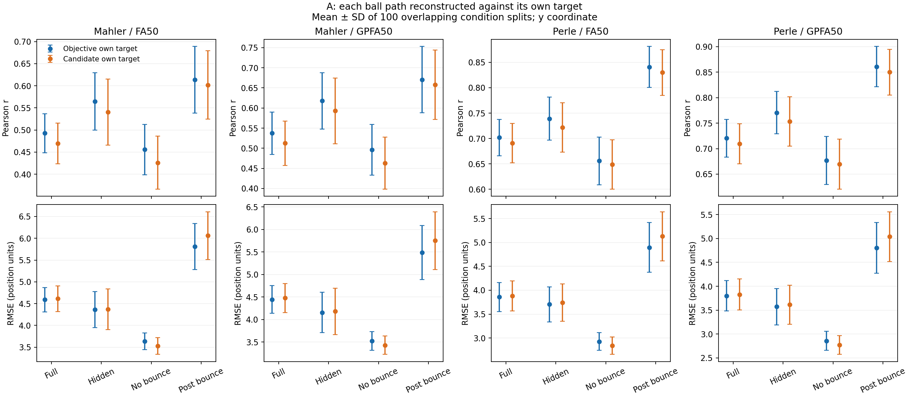
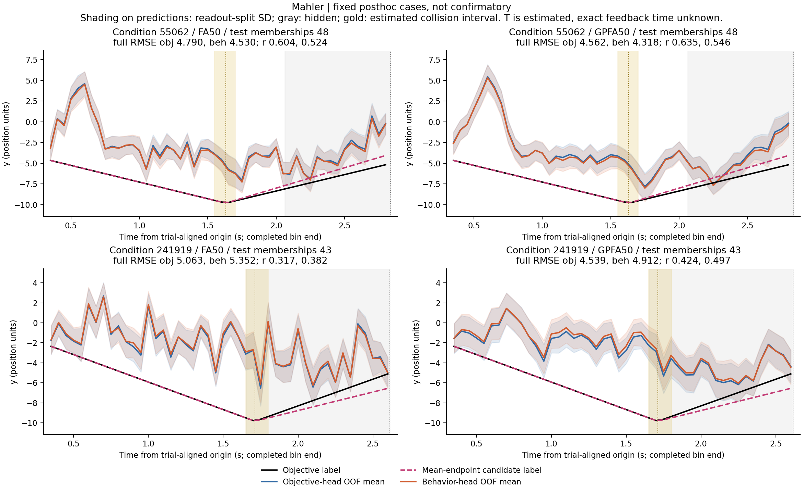
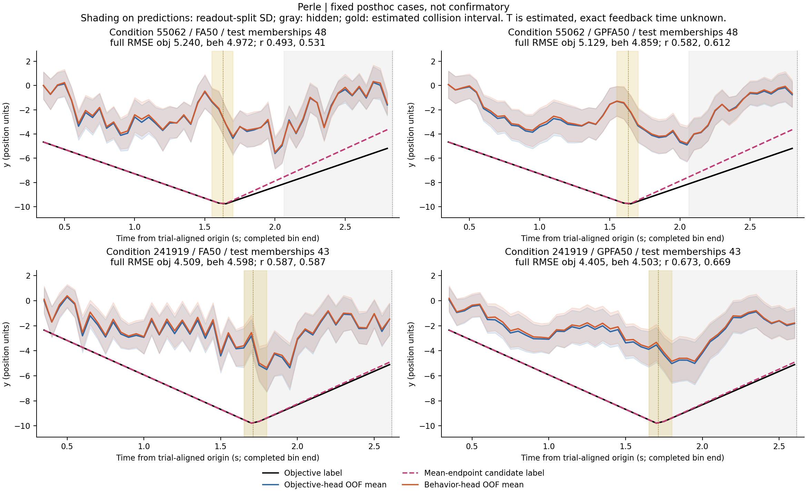
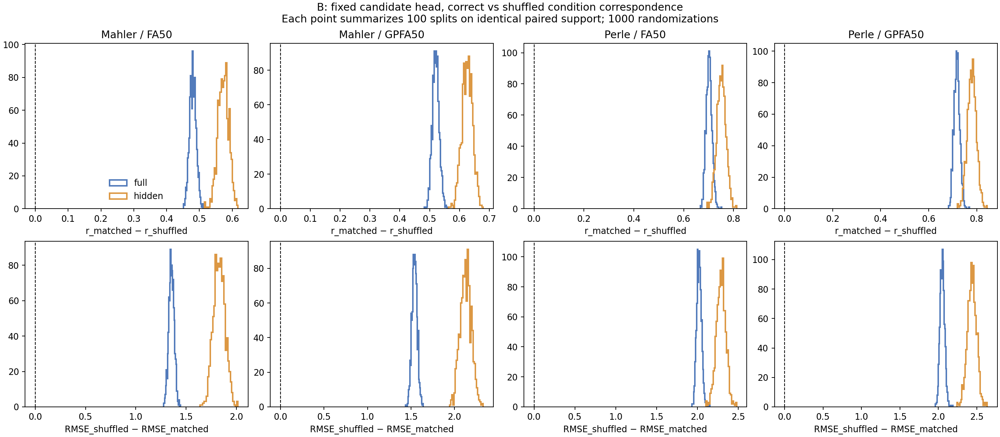
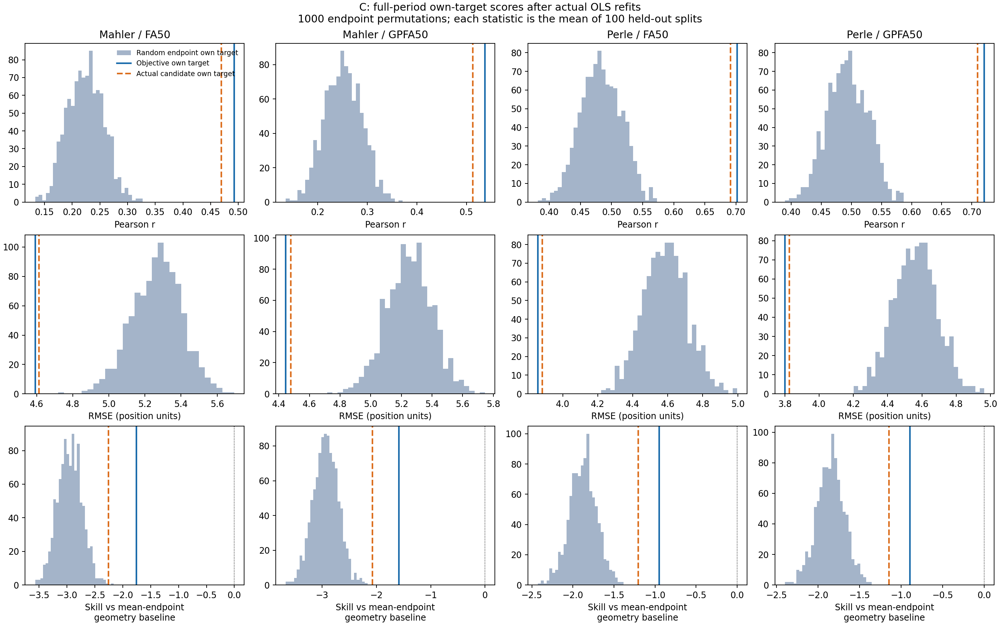
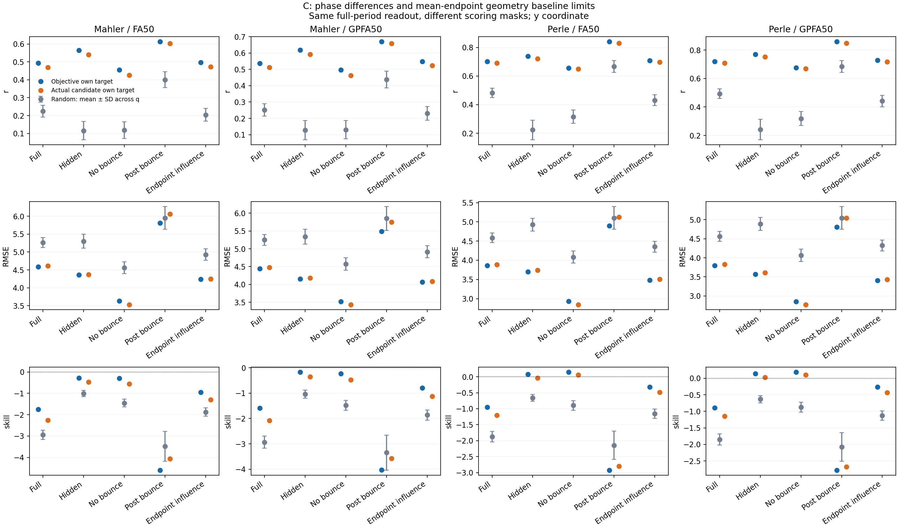
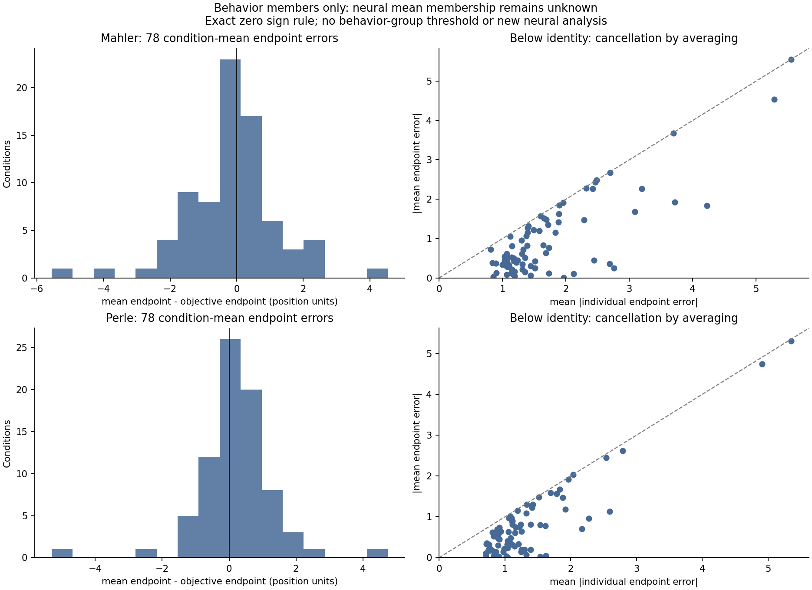

# Mental-Pong: closeout of the condition-mean endpoint study

## Research question and result

The study asks how well two position targets can be reconstructed from the same neural representation: the objective ball path and a behavior-constrained candidate path. Check A compares own-target and cross-target scores. Check B changes test-condition correspondence while keeping the trained readouts fixed. Check C redistributes endpoints, constructs new candidate paths and fits new OLS readouts. A has no randomized null distribution; B and C test different correspondences.

The released neural representations contain readable task-position structure. All four full-epoch own-target comparisons favor the objective path. Actual candidates outperform the random-endpoint reference over full, hidden and endpoint-influence ranges, with post-collision RMSE exceptions. Full-epoch neural reconstruction remains below the mean-endpoint geometry baseline; some Perle phase-specific skills are slightly positive.

**Scientific status: `CLOSED_EXPLORATORY_WITH_LIMITATIONS`. `raw_preprocessing=fail`.** Filtering and fit-source checks pass within the released-input scope. Upstream filling across conditions and times remains unresolved. This English publication edition preserves the completed science and records its editorial changes separately.

## Data and fixed candidate definition

Mahler and Perle are analyzed separately using half1 condition-mean DMFC responses. A condition identifies a fixed physical task configuration. The pseudopopulation combines units recorded across sessions; it does not represent a simultaneously observed single-trial population. All 79 IDs remain in 100 nominal 39-training/40-test splits. Condition 59920 lacks a usable collision anchor, leaving 78 valid conditions and 3369 condition-by-time rows per animal. Actual valid counts can be 38/39 training and 39/40 test conditions. Behavioral means use 7407 Mahler and 84873 Perle records; these are not independent neural trial counts.

Each split reuses stored factor analysis (FA50) and Gaussian-process factor analysis (GPFA50) representations. GPFA has one shared learnable RBF time scale. Ordinary least squares (OLS) uses 50 latent inputs and an intercept, giving 51 coefficients per coordinate and 102 per xy readout. There is no added regularization, scaling, behavioral feature or trial-count weighting. A single mapping covers valid visible and hidden rows at the original completed 50 ms bin-right-edge times. Existing mixed-boundary and terminal masks remain fixed.

For a collision condition, the candidate follows the objective path before collision and connects the original collision anchor to the condition-mean final paddle position afterward. A no-collision condition connects its starting point to that endpoint. After the anchor,

```text
alpha(t) = (x(t) - x_anchor) / (x_end - x_anchor)
y_candidate(t) = (1 - alpha(t)) * y_anchor + alpha(t) * mean_endpoint
```

x, arrival time and support remain unchanged. The final version does not use stop detection or repeated target updates. See the [locked protocol](configs/closeout_protocol.json), [source account](SOURCES.md) and [coverage](results/A/condition_label_coverage.csv).

## Completed experiments and version changes

The [experiment ledger](experiment_ledger.md) separates original reproduction/tool selection, early average-behavior proxies, the old all-79 segmented candidate, trial-endpoint labels, current condition-mean endpoints and checks A/B/C. Older GPFA64, Ridge and small-condition-set scores remain historical.

The trial-endpoint version repeated each condition's neural mean for multiple behavioral labels. It did not provide paired single-trial neural validation. The current version removes within-condition target variation and the additional weight of conditions with more behavioral records. The [version comparison](results/A/previous_trial_version_comparison.csv) therefore measures two changes together.

## A: own-target reconstruction

`OO` denotes the objective-trained readout scored against the objective path. `BB` denotes the candidate-trained readout scored against its candidate path. Define `Delta_r = r_beh - r_obj` and `Delta_RMSE = RMSE_obj - RMSE_beh`. Each split is scored on its original held-out rows before averaging over the 100 overlapping splits. Position units are centered MWorks display coordinates.

| animal | representation | r_obj | r_beh | RMSE_obj | RMSE_beh | Delta_r | Delta_RMSE |
| --- | --- | --- | --- | --- | --- | --- | --- |
| mahler | FA50 | 0.4928 | 0.4696 | 4.5909 | 4.6129 | -0.0232 | -0.0220 |
| mahler | GPFA50 | 0.5374 | 0.5126 | 4.4458 | 4.4781 | -0.0248 | -0.0322 |
| perle | FA50 | 0.7019 | 0.6910 | 3.8586 | 3.8829 | -0.0108 | -0.0242 |
| perle | GPFA50 | 0.7204 | 0.7094 | 3.8005 | 3.8265 | -0.0110 | -0.0261 |

All four full-epoch candidate RMSEs are higher by 0.0220–0.0322, and their correlations are lower. Hidden-period results have the same direction. No-collision segments have lower candidate RMSE and lower candidate correlation. Post-collision own-target RMSE favors the objective path.

| animal | representation | epoch | r_obj | r_beh | RMSE_obj | RMSE_beh | Delta_r | Delta_RMSE |
| --- | --- | --- | --- | --- | --- | --- | --- | --- |
| mahler | FA50 | hidden | 0.5644 | 0.5406 | 4.3630 | 4.3735 | -0.0238 | -0.0105 |
| mahler | FA50 | no_bounce | 0.4558 | 0.4261 | 3.6319 | 3.5249 | -0.0297 | 0.1070 |
| mahler | FA50 | post_bounce | 0.6137 | 0.6020 | 5.8091 | 6.0618 | -0.0117 | -0.2527 |
| mahler | GPFA50 | hidden | 0.6177 | 0.5928 | 4.1563 | 4.1806 | -0.0249 | -0.0243 |
| mahler | GPFA50 | no_bounce | 0.4963 | 0.4632 | 3.5235 | 3.4288 | -0.0332 | 0.0947 |
| mahler | GPFA50 | post_bounce | 0.6707 | 0.6580 | 5.4889 | 5.7516 | -0.0127 | -0.2628 |
| perle | FA50 | hidden | 0.7391 | 0.7216 | 3.7038 | 3.7421 | -0.0175 | -0.0383 |
| perle | FA50 | no_bounce | 0.6558 | 0.6488 | 2.9277 | 2.8384 | -0.0070 | 0.0893 |
| perle | FA50 | post_bounce | 0.8410 | 0.8300 | 4.8968 | 5.1280 | -0.0110 | -0.2312 |
| perle | GPFA50 | hidden | 0.7705 | 0.7534 | 3.5718 | 3.6130 | -0.0171 | -0.0412 |
| perle | GPFA50 | no_bounce | 0.6768 | 0.6696 | 2.8571 | 2.7679 | -0.0072 | 0.0892 |
| perle | GPFA50 | post_bounce | 0.8608 | 0.8499 | 4.8036 | 5.0392 | -0.0109 | -0.2357 |



The [full table](results/A/self_reconstruction_main_table.csv) retains all six phases, x, population SD and support counts. [Split scores](results/A/round_self_metrics.csv) and [paired distributions](figures/A_paired_differences.png) preserve uncertainty from readout splits. Shared conditions make those splits dependent; the SD is not uncertainty over 100 independent animal experiments. Constant or insufficient targets retain NA correlations.

## A: complete cross-scoring

`OB` scores the objective head against the candidate; `BO` scores the candidate head against the objective. Each cell below is r / RMSE.

| animal | representation | epoch | OO | OB | BO | BB |
| --- | --- | --- | --- | --- | --- | --- |
| mahler | FA50 | full | 0.4928 / 4.5909 | 0.4807 / 4.5803 | 0.4817 / 4.6249 | 0.4696 / 4.6129 |
| mahler | FA50 | hidden | 0.5644 / 4.3630 | 0.5511 / 4.3401 | 0.5546 / 4.3965 | 0.5406 / 4.3735 |
| mahler | GPFA50 | full | 0.5374 / 4.4458 | 0.5250 / 4.4412 | 0.5248 / 4.4861 | 0.5126 / 4.4781 |
| mahler | GPFA50 | hidden | 0.6177 / 4.1563 | 0.6047 / 4.1406 | 0.6060 / 4.2003 | 0.5928 / 4.1806 |
| perle | FA50 | full | 0.7019 / 3.8586 | 0.6952 / 3.8612 | 0.6972 / 3.8829 | 0.6910 / 3.8829 |
| perle | FA50 | hidden | 0.7391 / 3.7038 | 0.7248 / 3.7222 | 0.7356 / 3.7287 | 0.7216 / 3.7421 |
| perle | GPFA50 | full | 0.7204 / 3.8005 | 0.7133 / 3.8047 | 0.7160 / 3.8249 | 0.7094 / 3.8265 |
| perle | GPFA50 | hidden | 0.7705 / 3.5718 | 0.7556 / 3.5955 | 0.7678 / 3.5946 | 0.7534 / 3.6130 |

In all four full-epoch groups, OB is better than BB for the same candidate target, and OO is better than BO for the same objective target. Training the candidate head does not improve full-epoch held-out performance against either shared target. This comparison differs from OO versus BB, which changes both head and target. Changing the reference for a fixed head can also move r and RMSE in different directions: Mahler's objective predictions have slightly lower RMSE against the candidate but lower correlation.

The [contrast summary](results/A/contrast_summary.csv) keeps these comparisons separate. Independent replay of 400 test-prediction files agreed with the source scores to approximately 1.1e-14. Training predictions did not enter the summaries. The [complete cross table](results/A/cross_2x2_summary.csv) retains every phase.

The [all-condition heterogeneity plot](figures/descriptive/all79_condition_heterogeneity.png) includes missing condition 59920. Cases 55062 and 241919 are post hoc illustrations specified by the user. Condition 55062 has lower candidate own-target RMSE in all four groups; correlation decreases in Mahler and increases in Perle. Condition 241919 has worse candidate RMSE in all four groups. The [current case scores](results/descriptive/fixed_posthoc_case_scores.csv), [cross-scores](results/descriptive/fixed_posthoc_case_2x2.csv) and [case interpretation](results/descriptive/fixed_posthoc_case_interpretation.md) retain these differences.





Bands summarize predictions only when that condition was held out. They describe readout-split stability rather than animal trial variability. Complete all-79 atlases remain registered in the [source and artifact account](SOURCES.md).

## B: fixed-readout condition mismatch

Each animal has 1000 random repeats, each covering the original 100 splits. A repeat permutes only valid test conditions within that split. The same mapping is shared by FA/GPFA and all four head-target combinations. Readouts are never refitted. A score uses identical timestamps where both conditions are valid and belong to the scored phase. Matched scores are recomputed on every mismatch's exact support.

| animal | representation | epoch | head | matched_r | null_r | paired_r | matched_RMSE | null_RMSE | paired_RMSE |
| --- | --- | --- | --- | --- | --- | --- | --- | --- | --- |
| mahler | FA50 | full | D_beh | 0.4792 | -0.0008 | 0.4800 | 4.5582 | 5.9139 | 1.3557 |
| mahler | FA50 | full | D_obj | 0.5026 | -0.0009 | 0.5035 | 4.5548 | 6.0135 | 1.4587 |
| mahler | FA50 | hidden | D_beh | 0.5817 | 0.0087 | 0.5731 | 4.2446 | 6.0755 | 1.8309 |
| mahler | FA50 | hidden | D_obj | 0.6048 | 0.0073 | 0.5974 | 4.2777 | 6.2483 | 1.9706 |
| mahler | GPFA50 | full | D_beh | 0.5203 | -0.0002 | 0.5206 | 4.4277 | 5.9688 | 1.5411 |
| mahler | GPFA50 | full | D_obj | 0.5449 | -0.0004 | 0.5454 | 4.4147 | 6.0841 | 1.6694 |
| mahler | GPFA50 | hidden | D_beh | 0.6367 | 0.0106 | 0.6262 | 4.0229 | 6.1533 | 2.1303 |
| mahler | GPFA50 | hidden | D_obj | 0.6602 | 0.0087 | 0.6514 | 4.0403 | 6.3509 | 2.3106 |
| perle | FA50 | full | D_beh | 0.7028 | 0.0011 | 0.7017 | 3.8196 | 5.8405 | 2.0209 |
| perle | FA50 | full | D_obj | 0.7111 | 0.0005 | 0.7106 | 3.8138 | 5.8884 | 2.0746 |
| perle | FA50 | hidden | D_beh | 0.7555 | 0.0043 | 0.7512 | 3.6297 | 5.9205 | 2.2908 |
| perle | FA50 | hidden | D_obj | 0.7687 | 0.0043 | 0.7644 | 3.6384 | 6.0238 | 2.3854 |
| perle | GPFA50 | full | D_beh | 0.7185 | 0.0011 | 0.7174 | 3.7725 | 5.8248 | 2.0523 |
| perle | GPFA50 | full | D_obj | 0.7270 | 0.0005 | 0.7264 | 3.7650 | 5.8738 | 2.1089 |
| perle | GPFA50 | hidden | D_beh | 0.7848 | 0.0047 | 0.7801 | 3.4971 | 5.9357 | 2.4386 |
| perle | GPFA50 | hidden | D_obj | 0.7976 | 0.0047 | 0.7929 | 3.5032 | 6.0380 | 2.5348 |

These are paired-support means. Subtracting a short-support null from the original full-support score would answer a different question. The null destroys both physical and behavioral condition associations, so it supports condition-related correspondence without isolating behavior-specific representation.

| animal | epoch | mean_of_q_means | q025 | q975 | minimum_over_all_q_splits | maximum_over_all_q_splits | n_zero_support_q_splits |
| --- | --- | --- | --- | --- | --- | --- | --- |
| mahler | full | 0.8668 | 0.8641 | 0.8695 | 0.7940 | 0.9331 | 0 |
| mahler | visible | 0.8463 | 0.8431 | 0.8493 | 0.7609 | 0.9193 | 0 |
| mahler | hidden | 0.4733 | 0.4639 | 0.4832 | 0.2661 | 0.7001 | 0 |
| mahler | bounce | 0.2914 | 0.2716 | 0.3113 | 0.0000 | 0.7212 | 1249 |
| mahler | no_bounce | 0.5826 | 0.5730 | 0.5923 | 0.2022 | 0.8058 | 0 |
| mahler | post_bounce | 0.1759 | 0.1599 | 0.1934 | 0.0000 | 0.5863 | 1955 |
| perle | full | 0.8667 | 0.8643 | 0.8691 | 0.7968 | 0.9332 | 0 |
| perle | visible | 0.8462 | 0.8434 | 0.8493 | 0.7640 | 0.9197 | 0 |
| perle | hidden | 0.4731 | 0.4642 | 0.4822 | 0.2667 | 0.7015 | 0 |
| perle | bounce | 0.2911 | 0.2719 | 0.3118 | 0.0000 | 0.7309 | 1229 |
| perle | no_bounce | 0.5822 | 0.5729 | 0.5918 | 0.2046 | 0.8241 | 0 |
| perle | post_bounce | 0.1759 | 0.1604 | 0.1929 | 0.0000 | 0.6200 | 1894 |

The overlap fraction divides shared bins by the split's original phase support. Quantiles describe each random repeat's mean over 100 splits; extrema cover all repeat-by-split scores. Post-collision overlap averages about 17.6%, and some split mappings have zero phase support. Those cases remain in the records. Every split's 1000 sampled permutations was distinct, although an individual condition can keep its own mapping.



Because support changes with the mapping, tail quantities are empirical random-control proportions rather than exact fixed-support permutation p-values. The [summary](results/B/B_summary.csv), [coverage](results/B/B_coverage_summary.csv), [mapping audit](results/B/B_mapping_audit.csv) and [execution validation](results/B/B_validation.json) document the completed check. Full mappings and score arrays are in the [artifact registry](../../integration/artifact_registry.csv).

## C: random endpoints with new OLS fits

For each animal, 1000 permutations redistribute the 78 observed mean endpoints. A permutation remains fixed across time, all 100 splits and both representations. Each condition retains its own anchor, x, branch, arrival time and mask. All 78-by-78 anchor-endpoint combinations passed the geometry audit before new neural scoring; there was no clipping, score-based rejection or anchor adjustment. About 98.8% of Mahler and 98.7% of Perle endpoint identities change on average. Each animal's 1000 allocations is distinct.

The implementation completed 400 multioutput sklearn OLS solves, representing 400000 random xy heads. Each random y target has its own 51 coefficients. Identical x targets share the equivalent x solution. Batched fits were checked against separate OLS and the saved real-label heads. Random readouts see only training conditions' assigned labels and are scored against their own held-out random paths. Representations remain fixed. Saved coefficients, all split scores and preselected q=0/1/2 examples allow replay.

The endpoint-influence range consists of the existing 631 post-collision bins plus 2162 no-collision bins after the initial anchor: 2793 bins. It changes scoring support without fitting another readout.

| animal | representation | epoch | objective_mean_r | behavior_mean_r | null_mean_r | objective_mean_RMSE | behavior_mean_RMSE | null_mean_RMSE |
| --- | --- | --- | --- | --- | --- | --- | --- | --- |
| mahler | FA50 | endpoint_influence | 0.4970 | 0.4725 | 0.2043 | 4.2374 | 4.2476 | 4.9297 |
| mahler | FA50 | full | 0.4928 | 0.4696 | 0.2244 | 4.5909 | 4.6129 | 5.2653 |
| mahler | FA50 | hidden | 0.5644 | 0.5406 | 0.1157 | 4.3630 | 4.3735 | 5.3007 |
| mahler | GPFA50 | endpoint_influence | 0.5491 | 0.5233 | 0.2308 | 4.0695 | 4.0892 | 4.9174 |
| mahler | GPFA50 | full | 0.5374 | 0.5126 | 0.2515 | 4.4458 | 4.4781 | 5.2510 |
| mahler | GPFA50 | hidden | 0.6177 | 0.5928 | 0.1278 | 4.1563 | 4.1806 | 5.3401 |
| perle | FA50 | endpoint_influence | 0.7070 | 0.6964 | 0.4312 | 3.4845 | 3.5022 | 4.3535 |
| perle | FA50 | full | 0.7019 | 0.6910 | 0.4830 | 3.8586 | 3.8829 | 4.5856 |
| perle | FA50 | hidden | 0.7391 | 0.7216 | 0.2231 | 3.7038 | 3.7421 | 4.9272 |
| perle | GPFA50 | endpoint_influence | 0.7289 | 0.7183 | 0.4424 | 3.4093 | 3.4287 | 4.3246 |
| perle | GPFA50 | full | 0.7204 | 0.7094 | 0.4935 | 3.8005 | 3.8265 | 4.5621 |
| perle | GPFA50 | hidden | 0.7705 | 0.7534 | 0.2419 | 3.5718 | 3.6130 | 4.8862 |

Across full, hidden and endpoint-influence ranges, actual candidates exceed all 1000 random statistics on r and RMSE. The observed empirical fraction of random scores at least as good is 0/1000 for these comparisons. This finite sample does not imply zero probability or independent-experiment significance.

Post-collision correlation still favors actual candidates, while RMSE has exceptions:

| animal | representation | behavior_mean_r | null_mean_r | behavior_mean_RMSE | null_mean_RMSE | behavior_empirical_random_at_least_as_good_fraction_RMSE |
| --- | --- | --- | --- | --- | --- | --- |
| mahler | FA50 | 0.6020 | 0.4005 | 6.0618 | 5.9514 | 0.6430 |
| mahler | GPFA50 | 0.6580 | 0.4377 | 5.7516 | 5.8499 | 0.4060 |
| perle | FA50 | 0.8300 | 0.6659 | 5.1280 | 5.1039 | 0.5340 |
| perle | GPFA50 | 0.8499 | 0.6848 | 5.0392 | 5.0457 | 0.4890 |

Random paths retain shared starting points, collision anchors, horizontal motion and time structure; pre-collision samples are unchanged. Positive random-path correlation is therefore plausible. Matching endpoint distributions does not equalize path difficulty. The [complete results](results/C/random_endpoint_summary.csv) retain target SD, range, objective-path separation and scores for all phases.



## Mean-endpoint geometry baseline

For each split and label set, the baseline uses the valid training conditions' mean endpoint and each test condition's known geometry. The objective baseline uses the training mean of `objective_end_y`, while objective labels remain unchanged. This baseline includes task information outside the neural input.

```text
skill = 1 - SSE(neural reconstruction, target) / SSE(geometry baseline, target)
```

A zero denominator gives NA. The name refers to a mean endpoint, not a geometric mean.

| animal | representation | epoch | objective_mean | behavior_mean | null_mean |
| --- | --- | --- | --- | --- | --- |
| mahler | FA50 | full | -1.7543 | -2.2594 | -2.9485 |
| mahler | FA50 | hidden | -0.2769 | -0.4756 | -1.0076 |
| mahler | FA50 | no_bounce | -0.3027 | -0.5551 | -1.4566 |
| mahler | FA50 | endpoint_influence | -0.9463 | -1.2944 | -1.8753 |
| mahler | GPFA50 | full | -1.5883 | -2.0766 | -2.9314 |
| mahler | GPFA50 | hidden | -0.1646 | -0.3547 | -1.0411 |
| mahler | GPFA50 | no_bounce | -0.2276 | -0.4723 | -1.4765 |
| mahler | GPFA50 | endpoint_influence | -0.7985 | -1.1292 | -1.8637 |
| perle | FA50 | full | -0.9487 | -1.2057 | -1.8771 |
| perle | FA50 | hidden | 0.0805 | -0.0392 | -0.6612 |
| perle | FA50 | no_bounce | 0.1515 | 0.0623 | -0.8936 |
| perle | FA50 | endpoint_influence | -0.3175 | -0.4886 | -1.1538 |
| perle | GPFA50 | full | -0.8923 | -1.1445 | -1.8486 |
| perle | GPFA50 | hidden | 0.1430 | 0.0288 | -0.6342 |
| perle | GPFA50 | no_bounce | 0.1907 | 0.1065 | -0.8763 |
| perle | GPFA50 | endpoint_influence | -0.2626 | -0.4286 | -1.1260 |

All four full-epoch neural results are below the mean-endpoint geometry baseline. Phase-specific exceptions include Perle GPFA50 candidate skill of approximately 0.0288 in hidden samples and no-collision candidate skills of 0.0623/0.1065 for FA50/GPFA50. These small positive results prevent a claim that every phase falls below baseline. Exceeding random endpoints establishes neither a candidate advantage over the objective path nor broad superiority to shared geometry.



The [C methods and axes](results/C/README.md), [geometry audit](results/C/geometry_feasibility.json) and [completion record](results/C/completed.json) preserve the executed design. Large assignments, weights and replay examples are listed in the [registry](../../integration/artifact_registry.csv).

## Evidence assessment

**Recoverable task-position structure is supported within this data scope.** Held-out reconstruction, correct correspondence in B and actual-label advantages over C's primary ranges support this conclusion. The stronger known-geometry baseline limits a performance claim beyond shared geometry.

**A full-epoch candidate-path advantage is not supported.** All four OO/BB comparisons favor the objective target. No-collision RMSE improvements and post-collision differences remain phase-specific findings. Winning against random endpoints cannot reverse the direct own-target comparison, and different target difficulties prevent translating scores directly into neural preference.

**Within-condition neural differences between opposite behavioral outcomes were not tested.** Original members of the neural means remain unknown. The data cannot reconstruct those groups, and this limitation does not show that their neural representations are identical.

## Averaging and remaining limits

For a fixed condition, let `e_ci = endpoint_ci - objective_end_y_c` and `e_c = mean_i(e_ci)`. Signs use exact numerical zero; they do not classify psychological judgment errors. The table uses equal weight per condition for the error moments. Both animals have zero exactly zero-error records.

| animal | n_up | n_down | both_sign_conditions | mean_abs | abs_mean | mean_square | squared_mean | within_variance |
| --- | --- | --- | --- | --- | --- | --- | --- | --- |
| mahler | 3536 | 3871 | 77 | 1.7272 | 0.9784 | 5.7743 | 1.9690 | 3.8053 |
| perle | 50765 | 34108 | 78 | 1.3388 | 0.7908 | 3.5272 | 1.4164 | 2.1108 |

`mean_square = squared_mean + within_variance` holds to a maximum residual of 8.9e-15. Opposite errors occur in 77/78 Mahler and 78/78 Perle conditions. Median within-condition cancellation is 54.0% and 48.0%. Full-path candidate-objective RMS separation is 0.6760/0.5612; hidden separation is 1.0006/0.8472. These are below the reconstruction RMSE scale. Path separation pools valid label rows, whereas the primary reconstruction score averages separately scored splits. Their comparison is descriptive, not a power calculation.



The [condition audit](results/descriptive/endpoint_condition_audit.csv), [path comparison](results/descriptive/path_separation_vs_error.csv) and [descriptive account](results/descriptive/mean_cancellation_interpretation.md) support cancellation in behavior. They do not measure lost neural information or establish identical behavior and neural membership. The trial-label comparison also changes condition weights, so averaging cannot explain the full result on its own.

The unresolved limits are upstream cross-condition/time filling, unknown neural mean membership, unverified strictly pre-feedback timing of the final paddle scalar, collision anchors estimated from 50 ms released paths and repeated splits/randomizations that create no new neural trials. None of A/B/C removes these limits or establishes a unique computation, an internal ball path or a causal neural mechanism.

## Future design and closeout

The [historical future design](future_design.md) requires genuine paired neural and behavioral records before constructing above-target, below-target and near-correct group means. It does not authorize new experiments. The [current cross-study plan](../../../../docs/FUTURE_DIRECTIONS.md) is the single active research plan.

The source project completed A, B1000 and C1000, averaging checks, condition heterogeneity and post hoc examples. It retains `CLOSED_EXPLORATORY_WITH_LIMITATIONS`. [Scientific acceptance](results/final_acceptance_audit.json) and the [source manifest](manifest.json) are separate from [integration verification](../../integration/verification.json). See the [entry point](../../README.md) for read-only checks and replay. No full scientific run was performed to produce this English edition.
