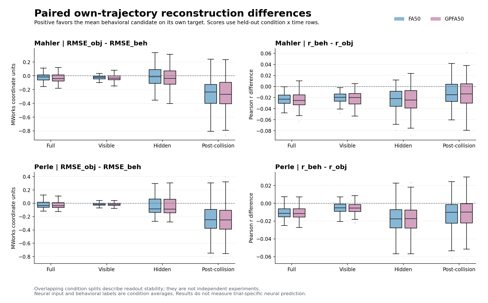

# Condition-mean endpoint paths: FA50/GPFA50 and OLS position reconstruction

## Own-target reconstruction

All four full-epoch comparisons favor the objective ball path. The behavior-constrained candidate path has lower correlation and slightly higher RMSE. Candidate RMSE exceeds objective RMSE by 0.0220–0.0322 position units. The earlier trial-label version had a larger gap; the two versions also differ in condition weighting, so this change cannot be attributed solely to averaging.

Define `Delta_r = r_beh - r_obj` and `Delta_RMSE = RMSE_obj - RMSE_beh`. A positive difference favors the candidate on that metric. Each split is scored on its original held-out condition-by-time predictions before the 100 split scores are summarized. Scores of an averaged prediction curve are a separate descriptive quantity.

| animal | representation | r_obj (mean +/- SD) | r_beh (mean +/- SD) | RMSE_obj (mean +/- SD) | RMSE_beh (mean +/- SD) | Delta_r (mean +/- SD) | Delta_RMSE (mean +/- SD) |
| --- | --- | --- | --- | --- | --- | --- | --- |
| mahler | FA50 | 0.4928 +/- 0.0440 | 0.4696 +/- 0.0463 | 4.5909 +/- 0.2805 | 4.6129 +/- 0.2929 | -0.0232 +/- 0.0105 | -0.0220 +/- 0.0536 |
| mahler | GPFA50 | 0.5374 +/- 0.0525 | 0.5126 +/- 0.0551 | 4.4458 +/- 0.3074 | 4.4781 +/- 0.3226 | -0.0248 +/- 0.0146 | -0.0322 +/- 0.0635 |
| perle | FA50 | 0.7019 +/- 0.0360 | 0.6910 +/- 0.0386 | 3.8586 +/- 0.3045 | 3.8829 +/- 0.3133 | -0.0108 +/- 0.0067 | -0.0242 +/- 0.0531 |
| perle | GPFA50 | 0.7204 +/- 0.0367 | 0.7094 +/- 0.0395 | 3.8005 +/- 0.3156 | 3.8265 +/- 0.3246 | -0.0110 +/- 0.0070 | -0.0261 +/- 0.0544 |

**This is an analysis of condition-mean neural responses and condition-mean behavioral targets. `raw_preprocessing=fail` remains part of the result.** Filtering and fit-source checks pass within the released-input scope. They do not remove upstream filling across conditions and times.

## Candidate and readout definitions

Each physical condition uses the same fixed set of valid behavioral records as the preceding version. Their final paddle positions are averaged. The endpoint connection is linear, so constructing a path from the mean endpoint equals averaging these records' candidate paths. Membership remains fixed across time. Correctness, endpoint error and neural scores do not select records.

Before a collision the candidate follows the objective ball path. After the collision it joins the original collision anchor to the mean endpoint. A no-collision candidate joins the task starting point to that endpoint. Both labels share x and the estimated arrival time. There is no stop detection or repeated target update in this version.

The fitting unit is one valid condition-by-time row. Behavioral record counts describe the mean's source and do not weight OLS. Longer valid sequences contribute more rows; no additional equal-condition weighting is applied. One ordinary least-squares (OLS) linear mapping covers valid visible and hidden samples. It has 50 inputs and an intercept: 51 coefficients per coordinate, 102 per xy head. No regularization, added scaling or extra behavioral features are used.

The study reuses each split's training-side factor analysis (FA50) and Gaussian-process factor analysis (GPFA50) representations. GPFA has one shared learnable radial-basis-function (RBF) time scale. The half1 latent values, neuron order, input scale, 100 condition splits and completed 50 ms bin-right-edge convention remain fixed. Representations and halves are not averaged or refitted in this version. See the [protocol](configs/analysis_protocol.json), [representation reuse audit](results/reused_representation_audit.json) and [protocol comparison](protocol_diff.md).

## Coverage and label checks

| Animal | Source behavioral records | Records in means | Valid conditions | Condition-by-time rows |
| --- | ---: | ---: | ---: | ---: |
| Mahler | 8078 | 7407 | 78 | 3369 |
| Perle | 89601 | 84873 | 78 | 3369 |

All 79 physical condition IDs remain in the nominal 39-training/40-test splits. Condition 59920 has an unresolved collision anchor and contributes no candidate rows. It is never replaced or filled with the objective label. Actual valid training counts can therefore be 38 or 39, with 39 or 40 valid test conditions.

The [coverage table](results/condition_label_coverage.csv) retains every identity, record count and missing-data reason. The [averaging audit](results/condition_averaging_audit.json) checks membership, fixed support, the endpoint formula, missing values and identical x labels. Detailed memberships and condition-by-time indices are registered with the [artifact inventory](../../integration/artifact_registry.csv).

Behavioral mean membership is traceable. The released neural means' original unit-by-trial members have not been recovered. Alignment is by physical condition, without proof that the neural and behavioral means contain the same trials. The final paddle scalar's strictly pre-feedback timing is unverified. Collision anchors are estimated from released trajectories rather than exact trial event logs. Terminal bins containing feedback or termination remain excluded. Bins crossing the occlusion boundary enter `full` but neither pure `visible` nor pure `hidden`.

## Phase-specific reconstruction

Position and RMSE use MWorks centered display-coordinate units. Counts in the main table describe unique valid support across the dataset; per-split counts are also saved. Undefined correlations remain NA, including constant targets, while RMSE can remain defined.

| animal | representation | epoch | r_obj | r_beh | RMSE_obj | RMSE_beh | Delta_r | Delta_RMSE |
| --- | --- | --- | --- | --- | --- | --- | --- | --- |
| mahler | FA50 | full | 0.4928 | 0.4696 | 4.5909 | 4.6129 | -0.0232 | -0.0220 |
| mahler | FA50 | visible | 0.4299 | 0.4097 | 4.7691 | 4.7965 | -0.0203 | -0.0273 |
| mahler | FA50 | hidden | 0.5644 | 0.5406 | 4.3630 | 4.3735 | -0.0238 | -0.0105 |
| mahler | FA50 | bounce | 0.5660 | 0.5528 | 5.9282 | 6.0919 | -0.0132 | -0.1637 |
| mahler | FA50 | no_bounce | 0.4558 | 0.4261 | 3.6319 | 3.5249 | -0.0297 | 0.1070 |
| mahler | FA50 | post_bounce | 0.6137 | 0.6020 | 5.8091 | 6.0618 | -0.0117 | -0.2527 |
| mahler | GPFA50 | full | 0.5374 | 0.5126 | 4.4458 | 4.4781 | -0.0248 | -0.0322 |
| mahler | GPFA50 | visible | 0.4685 | 0.4466 | 4.6603 | 4.6940 | -0.0219 | -0.0337 |
| mahler | GPFA50 | hidden | 0.6177 | 0.5928 | 4.1563 | 4.1806 | -0.0249 | -0.0243 |
| mahler | GPFA50 | bounce | 0.6076 | 0.5933 | 5.7253 | 5.8997 | -0.0143 | -0.1744 |
| mahler | GPFA50 | no_bounce | 0.4963 | 0.4632 | 3.5235 | 3.4288 | -0.0332 | 0.0947 |
| mahler | GPFA50 | post_bounce | 0.6707 | 0.6580 | 5.4889 | 5.7516 | -0.0127 | -0.2628 |
| perle | FA50 | full | 0.7019 | 0.6910 | 3.8586 | 3.8829 | -0.0108 | -0.0242 |
| perle | FA50 | visible | 0.6717 | 0.6664 | 3.9777 | 3.9918 | -0.0053 | -0.0141 |
| perle | FA50 | hidden | 0.7391 | 0.7216 | 3.7038 | 3.7421 | -0.0175 | -0.0383 |
| perle | FA50 | bounce | 0.7868 | 0.7776 | 5.1159 | 5.2585 | -0.0092 | -0.1426 |
| perle | FA50 | no_bounce | 0.6558 | 0.6488 | 2.9277 | 2.8384 | -0.0070 | 0.0893 |
| perle | FA50 | post_bounce | 0.8410 | 0.8300 | 4.8968 | 5.1280 | -0.0110 | -0.2312 |
| perle | GPFA50 | full | 0.7204 | 0.7094 | 3.8005 | 3.8265 | -0.0110 | -0.0261 |
| perle | GPFA50 | visible | 0.6796 | 0.6742 | 3.9696 | 3.9851 | -0.0055 | -0.0155 |
| perle | GPFA50 | hidden | 0.7705 | 0.7534 | 3.5718 | 3.6130 | -0.0171 | -0.0412 |
| perle | GPFA50 | bounce | 0.8030 | 0.7939 | 5.0658 | 5.2108 | -0.0091 | -0.1450 |
| perle | GPFA50 | no_bounce | 0.6768 | 0.6696 | 2.8571 | 2.7679 | -0.0072 | 0.0892 |
| perle | GPFA50 | post_bounce | 0.8608 | 0.8499 | 4.8036 | 5.0392 | -0.0109 | -0.2357 |

No-collision segments have lower candidate RMSE but lower candidate correlation. Post-collision segments have higher candidate RMSE. These phase differences remain distinct from the full-epoch result. The 100 splits share conditions; their population SD measures readout-split stability, not 100 independent animal experiments. The [complete table](results/self_reconstruction_main_table.csv), [split scores](results/round_self_metrics.csv) and [condition comparisons](results/condition_self_comparison.csv) preserve counts, missing values and test membership frequencies.

## Condition, time, bias and amplitude

| animal | representation | epoch | n_valid_conditions | candidate_lower_RMSE | candidate_higher_r |
| --- | --- | --- | --- | --- | --- |
| mahler | FA50 | full | 78 | 45 | 27 |
| mahler | FA50 | hidden | 78 | 51 | 44 |
| mahler | FA50 | post_bounce | 26 | 11 | 4 |
| mahler | GPFA50 | full | 78 | 42 | 29 |
| mahler | GPFA50 | hidden | 78 | 47 | 47 |
| mahler | GPFA50 | post_bounce | 26 | 10 | 6 |
| perle | FA50 | full | 78 | 43 | 43 |
| perle | FA50 | hidden | 78 | 47 | 45 |
| perle | FA50 | post_bounce | 26 | 13 | 12 |
| perle | GPFA50 | full | 78 | 43 | 43 |
| perle | GPFA50 | hidden | 78 | 45 | 43 |
| perle | GPFA50 | post_bounce | 26 | 13 | 11 |

Aggregate scores do not describe every condition. The [binwise table](results/binwise_reconstruction.csv) contains actual times, test counts, own-target RMSE and bias, target separation and prediction separation. Its errors come from individual held-out predictions.

| animal | representation | head | target_sd | prediction_sd | bias | amplitude_ratio |
| --- | --- | --- | --- | --- | --- | --- |
| mahler | FA50 | D_beh | 5.0829 | 2.9362 | -0.0677 | 0.5799 |
| mahler | FA50 | D_obj | 5.1455 | 2.9830 | -0.0676 | 0.5816 |
| mahler | GPFA50 | D_beh | 5.0829 | 3.0557 | -0.0802 | 0.6032 |
| mahler | GPFA50 | D_obj | 5.1455 | 3.1328 | -0.0872 | 0.6106 |
| perle | FA50 | D_beh | 5.1190 | 2.6706 | -0.0369 | 0.5234 |
| perle | FA50 | D_obj | 5.1456 | 2.6983 | -0.0398 | 0.5260 |
| perle | GPFA50 | D_beh | 5.1190 | 2.6399 | -0.0573 | 0.5174 |
| perle | GPFA50 | D_obj | 5.1456 | 2.6697 | -0.0524 | 0.5204 |

Bias is reconstructed position minus its own target. An amplitude ratio below one means reconstructed positions vary less than the reference. Opposite errors can cancel in a pooled bias, so a small bias does not imply small condition-specific shifts.

The original 20-page atlases cover all 79 IDs for each animal. Each condition has parallel FA/GPFA panels with the objective path, objective-head reconstruction, candidate path and candidate-head reconstruction. They use shared time and coordinate ranges and show occlusion, the estimated collision interval and arrival time. Condition 59920 is explicitly missing. Prediction bands describe test-split stability. Locate the preserved atlases and their figure manifests through the [artifact inventory](../../integration/artifact_registry.csv); their availability is separate from the compact report.

## Comparison with trial-label fitting

| animal | representation | r_obj_trial_version | r_obj_condition_mean | r_beh_trial_version | r_beh_condition_mean | RMSE_obj_trial_version | RMSE_obj_condition_mean | RMSE_beh_trial_version | RMSE_beh_condition_mean |
| --- | --- | --- | --- | --- | --- | --- | --- | --- | --- |
| mahler | FA50 | 0.4834 | 0.4928 | 0.4544 | 0.4696 | 4.6536 | 4.5909 | 4.7663 | 4.6129 |
| mahler | GPFA50 | 0.5276 | 0.5374 | 0.4964 | 0.5126 | 4.5077 | 4.4458 | 4.6327 | 4.4781 |
| perle | FA50 | 0.7000 | 0.7019 | 0.6831 | 0.6910 | 3.9135 | 3.8586 | 4.0008 | 3.8829 |
| perle | GPFA50 | 0.7190 | 0.7204 | 0.7015 | 0.7094 | 3.8544 | 3.8005 | 3.9449 | 3.8265 |

The [complete version comparison](results/previous_trial_version_comparison.csv) retains every phase. Averaging removes within-condition target variation. Moving from trial-by-time rows to condition-by-time rows also removes the additional fitting and scoring contribution of conditions with more behavioral records. In the earlier version, repeated neural inputs make fitting algebraically equivalent to a condition-mean fit weighted by valid record count. This is a two-change comparison rather than a one-factor averaging ablation. Both versions use the same representations.

## Cross-scoring and interpretation

The [complete 2x2 table](results/cross_2x2_summary.csv) scores both heads against both targets. `OO` versus `BB` compares own-target reconstruction. `OB` versus `BB` holds the candidate target fixed; `OO` versus `BO` holds the objective target fixed. x labels, coefficients and predictions agree between heads and provide an implementation check rather than separate behavioral evidence.

Targets differ in variance and reconstruction difficulty. Lower own-target error alone does not establish a neural preference. Condition means cannot resolve different trials of the same condition, establish an internal ball path or identify a unique algorithm. The subsequent [closeout](../closeout_v1/FINAL_REPORT.md) adds two distinct randomization controls and a mean-endpoint geometry baseline without changing this result.

## Reproducibility and publication provenance

Use the [module entry point](../../README.md) to inspect reports, verify available artifacts or replay a saved case. The [original score audit](results/final_integrity_and_score_audit.json), [fixed splits](configs/condition_splits_100.json) and [manifest](manifest.json) document the scientific record. Large weights, predictions and source representations are listed in the [registry](../../integration/artifact_registry.csv). This English edition has a new document hash recorded in the [migration map](../../integration/migration_map.csv); it does not inherit the original report's byte hash.
